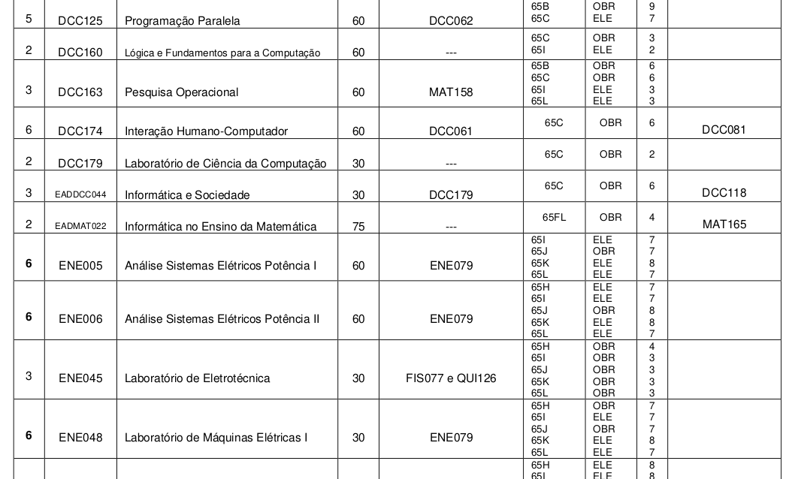
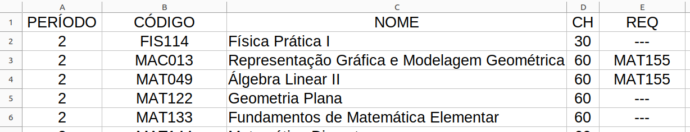
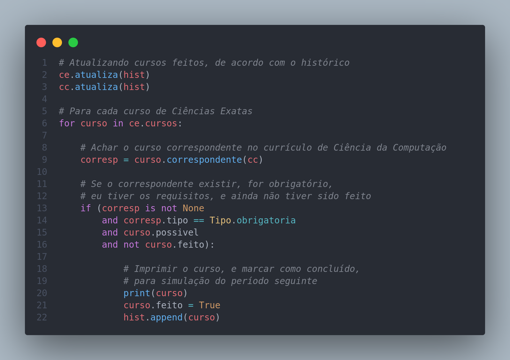

# O que é este programa?

Programa básico em Python que usa leitura de arquivos de dados e orientação à objetos para representar disciplinas/cursos e currículos, de forma que eu possa analisar a melhor sequência de disciplinas a serem feitas na minha graduação. 

## Que problema ele resolve?

A dificuldade em montar meu currículo de Ciências Exatas (gradução que possui currículo flexível), de forma que considere as disciplinas que eu já realizei, que respeite os pré-requisitos das disciplinas, e contribua ao mesmo tempo para o cumprimento da grade de Ciências Exatas, e das obrigatórias de Ciênca da Computação, permitindo que eu conclua as 2 graduações no menor tempo possível. 

Ainda por cima, os dados das disciplinas que podem compor os currículos, se encontram em tabelas ao longo de mais 30 páginas de documentos PDF, o que pode ser um tanto confuso. 

 

## Como ele resolve o problema?

A conversão dos dados em PDF para arquivos CSV, como o seguinte, permitiu a fácil leitura dos dados e construção dos objetos que representa os cursos e o currículo (um conjunto de cursos, com outros atributos e métodos relacionados).

 

A partir de então, com o uso de boas práticas na nomeação das variáveis, abstração e encapsulamento, foi possível usar esse programa abstrato e intuitivo para determinar quais disciplinas eu poderia fazer de tal currículo, considerando meu histórico escolar atual:

 

## Quais foi o resultado

Uma lista dizendo exatamente quais disciplinas devo fazer em cada período, para que eu conclua a graduação em Ciências Exatas no menor tempo possível, e ao mesmo tempo contribua no cumprimento da carga horária da minha futura graduação em Ciência da Computação.

```
 ========== OBRIGATÓRIAS - PERÍODO 2 ========== 

FIS077 | LABORATÓRIO DE FÍSICA I
MAT143 | INTRODUÇÃO À TEORIA DOS NÚMEROS
DCC013 | ESTRUTURA DE DADOS
DCC160 | LÓGICA E FUNDAMENTOS PARA A COMPUTAÇÃO
DCC070 | ORGANIZAÇÃO DE COMPUTADORES
DCC163 | PESQUISA OPERACIONAL
EST029 | CÁLCULO DE PROBABILIDADES I
DCC025 | ORIENTAÇÃO A OBJETOS

 ========== OBRIGATÓRIAS - PERÍODO 3 ========== 

DCC001 | ANÁLISE E PROJETO DE ALGORITMOS
DCC012 | ESTRUTURA DE DADOS II
DCC059 | TEORIA DOS GRAFOS
DCC063 | LINGUAGENS FORMAIS E AUTÔMATOS
DCC042 | REDES DE COMPUTADORES
DCC062 | SISTEMAS OPERACIONAIS
DCC117 | MODELAGEM DE SISTEMAS

...
```
